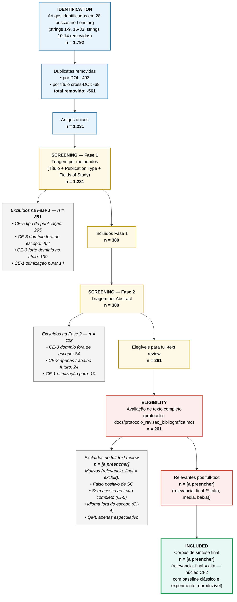

# Diagrama PRISMA-ScR — Fluxo de Seleção de Artigos

## 1. Sobre este documento

Este documento apresenta o **fluxo PRISMA-ScR** (Preferred Reporting Items for Systematic Reviews and Meta-Analyses — extension for Scoping Reviews) consolidado da revisão sistemática sobre **Quantum Machine Learning aplicado a previsão de demanda e controle de inventário em cadeias de suprimentos**.

O diagrama segue a estrutura canônica de 4 blocos (Tricco et al., 2018):

1. **Identification** — artigos brutos das bases, deduplicação
2. **Screening** — triagem automatizada por metadados e abstract
3. **Eligibility** — avaliação de texto completo
4. **Included** — corpus final para síntese do artigo

Os números dos blocos 1–2 são **consolidados** (2026-04-14, após 5 iterações de refinamento). Os blocos 3–4 contêm **placeholders** (`[a preencher]`) a serem atualizados ao final da extração manual via `data/tabela_revisao_bibliografica.xlsx`.

---

## 2. Diagrama (Mermaid)



---

## 3. Diagrama (ASCII — inspeção rápida em terminal)

```
╔═══════════════════════════════════════════════════════════════════╗
║                        IDENTIFICATION                             ║
╠═══════════════════════════════════════════════════════════════════╣
║  Artigos identificados em 28 buscas no Lens.org                   ║
║  (strings 1-9, 15-33; strings 10-14 removidas por baixa precisão) ║
║                             n = 1.792                             ║
╚═══════════════════════════════════════════════════════════════════╝
                                 │
                                 ▼
                 ┌──────────────────────────────┐
                 │ Duplicatas removidas: -561   │
                 │   • por DOI:              -493│
                 │   • por título cross-DOI:  -68│
                 └──────────────────────────────┘
                                 │
                                 ▼
                     ┌─────────────────────┐
                     │  Artigos únicos     │
                     │      n = 1.231      │
                     └─────────────────────┘
                                 │
╔════════════════════════════════╪══════════════════════════════════╗
║                          SCREENING                                ║
╠════════════════════════════════╪══════════════════════════════════╣
║                                ▼                                  ║
║   FASE 1 — Triagem por Metadados (Título + Type + Fields)         ║
║   Entrada: n = 1.231                                              ║
║                                                                   ║
║   Excluídos: n = 851 ────────────────────────────────────┐        ║
║     • CE-5 tipo de publicação:              295           │       ║
║     • CE-3 domínio fora de escopo:          404           │       ║
║     • CE-3 forte (domínio claro no título): 139           │       ║
║     • CE-1 otimização pura:                  14           │       ║
║                                │                          │       ║
║                                ▼                          │       ║
║                    Incluídos Fase 1: n = 380              │       ║
║                                │                          │       ║
║                                ▼                          │       ║
║   FASE 2 — Triagem por Abstract                           │       ║
║   Entrada: n = 380                                        │       ║
║                                                           │       ║
║   Excluídos: n = 118 ─────────────────────────────────────┤       ║
║     • CE-3 domínio fora de escopo:           84           │       ║
║     • CE-2 apenas trabalho futuro:           24           │       ║
║     • CE-1 otimização pura:                  10           │       ║
║                                │                          │       ║
║                                ▼                          │       ║
║            Elegíveis full-text: n = 261 (21,2%)           │       ║
╚════════════════════════════════╪══════════════════════════╪═══════╝
                                 │                          │
                                 │        Total excluídos   │
                                 │        na triagem: 969   │
                                 │              (78,8%)     │
                                 ▼                          │
╔═══════════════════════════════════════════════════════════╪═══════╗
║                         ELIGIBILITY                       │       ║
╠═══════════════════════════════════════════════════════════╪═══════╣
║                                                           │       ║
║   Full-text review                                        │       ║
║   (protocolo: docs/protocolo_revisao_bibliografica.md)    │       ║
║   Entrada: n = 261                                        │       ║
║                                                           │       ║
║   Excluídos: n = [a preencher] ───────────────────────────┤       ║
║     Motivos (relevancia_final = excluir):                 │       ║
║       • Falso positivo de SC                              │       ║
║       • Sem acesso ao texto completo (CI-5)               │       ║
║       • Idioma fora do escopo (CI-4)                      │       ║
║       • QML apenas especulativo                           │       ║
║                                │                          │       ║
║                                ▼                          │       ║
║        Relevantes pós full-text: n = [a preencher]        │       ║
║        (relevancia_final ∈ {alta, media, baixa})          │       ║
╚════════════════════════════════╪══════════════════════════╪═══════╝
                                 │                          │
                                 ▼                          ▼
╔═══════════════════════════════════════════════╗   ┌──────────────┐
║                   INCLUDED                    ║   │  EXCLUÍDOS   │
╠═══════════════════════════════════════════════╣   │   (total)    │
║                                               ║   │ 969 + [?] =  │
║   Corpus de síntese final                     ║   │   [total]    │
║   n = [a preencher]                           ║   └──────────────┘
║                                               ║
║   Critério: relevancia_final = alta           ║
║   (núcleo CI-2 com baseline clássico e        ║
║    experimento reproduzível)                  ║
║                                               ║
║   Distribuição esperada por tipo_problema     ║
║   (prioridade decrescente):                   ║
║     1. backorder_prediction                   ║
║     2. demand_forecasting                     ║
║     3. inventory_control                      ║
║     4. demais categorias de SC                ║
╚═══════════════════════════════════════════════╝
```

---

## 4. Procedimento de Atualização pós Full-Text Review

Após conclusão da extração manual em `data/tabela_revisao_bibliografica.xlsx`, os placeholders `[a preencher]` devem ser substituídos pelos valores derivados das seguintes queries na tabela:

| Campo no diagrama | Query na tabela |
|---|---|
| Excluídos no full-text | `count(relevancia_final == 'excluir')` |
| Relevantes pós full-text | `count(relevancia_final in ['alta', 'media', 'baixa'])` |
| Corpus de síntese final | `count(relevancia_final == 'alta')` |
| Motivos de exclusão (breakdown) | Agrupamento por categoria em `notas` dos artigos com `relevancia_final == 'excluir'` |

Sugestão de script auxiliar (a criar quando a extração manual estiver avançada): `src/gerar_diagrama_prisma.py` que lê o `.xlsx` e regenera este documento com os números preenchidos, garantindo consistência entre a tabela e o diagrama.

---

## 5. Estatísticas Derivadas (pós full-text)

Campos a reportar no artigo final, derivados da tabela de extração:

1. **Taxa de precisão da triagem automatizada**
   `precisao = 1 - (excluídos no full-text / 261)`
   Esperado: ≥ 85% (dado o refinamento de 5 iterações).

2. **Precisão da classificação automática `tipo_problema`**
   `acuracia = count(tipo_problema_auto == problema_validado) / count(revisado == 'sim')`

3. **Distribuição final por `metodo_qml`** entre os relevantes

4. **Distribuição final por `resultado_qml_vs_classico`** — ponto central da discussão sobre viabilidade do QML vs. baselines clássicos

---

## 6. Referências

- Tricco, A. C., Lillie, E., Zarin, W., O'Brien, K. K., Colquhoun, H., Levac, D., ... & Straus, S. E. (2018). **PRISMA Extension for Scoping Reviews (PRISMA-ScR): Checklist and Explanation**. *Annals of Internal Medicine*, 169(7), 467-473. https://doi.org/10.7326/M18-0850
- Page, M. J., McKenzie, J. E., Bossuyt, P. M., et al. (2021). **The PRISMA 2020 statement: an updated guideline for reporting systematic reviews**. *BMJ*, 372:n71.
- Arksey, H., & O'Malley, L. (2005). **Scoping studies: towards a methodological framework**. *International Journal of Social Research Methodology*, 8(1), 19-32.

---

*Documento criado em: 2026-04-14*
*Status dos dados: blocos Identification + Screening consolidados; blocos Eligibility + Included aguardam full-text review*
*Fonte de dados (triagem): `data/artigos_unicos_triagem.csv`*
*Fonte de dados (full-text, futuro): `data/tabela_revisao_bibliografica.xlsx`*
