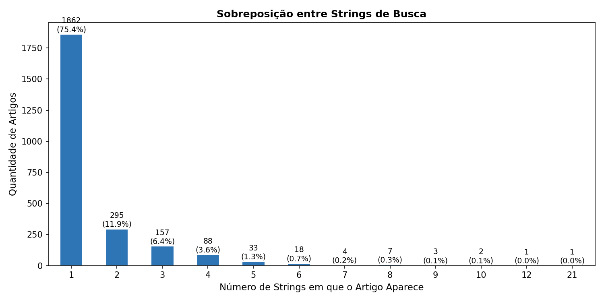
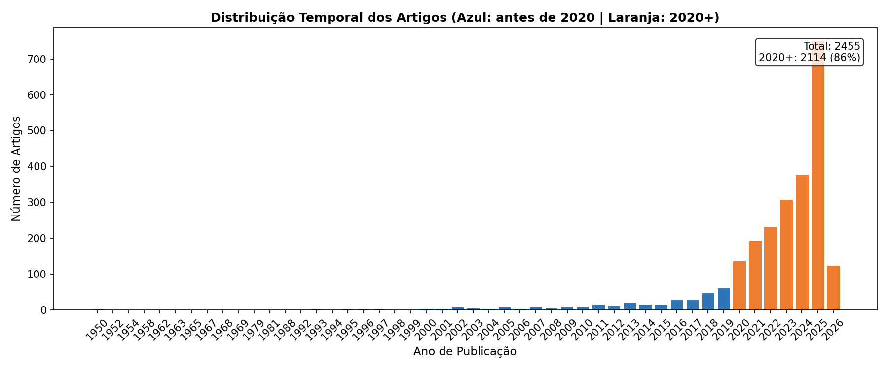
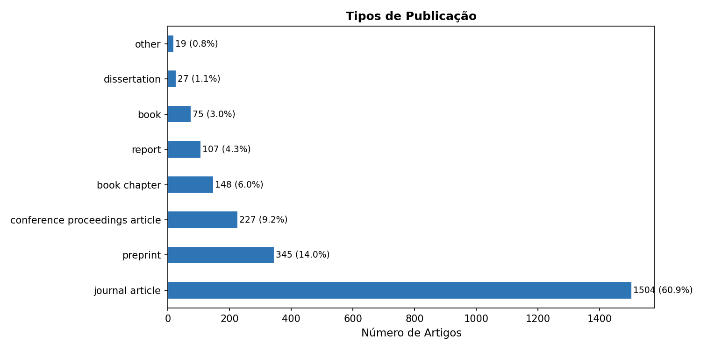
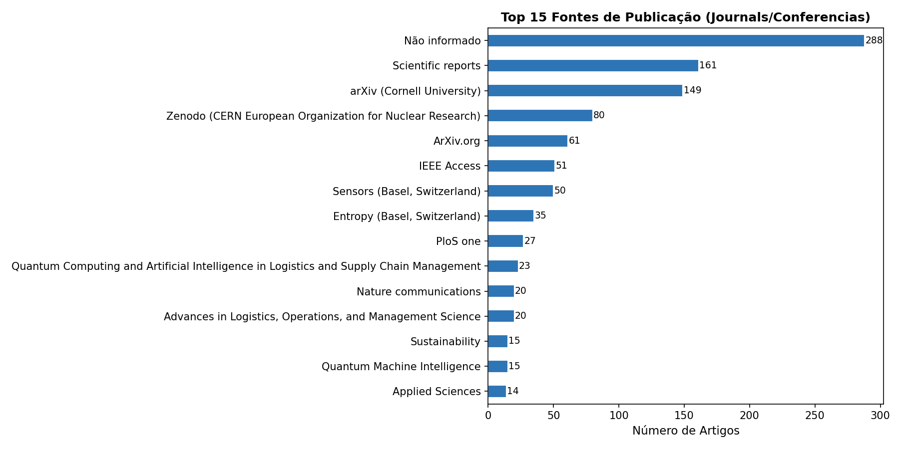
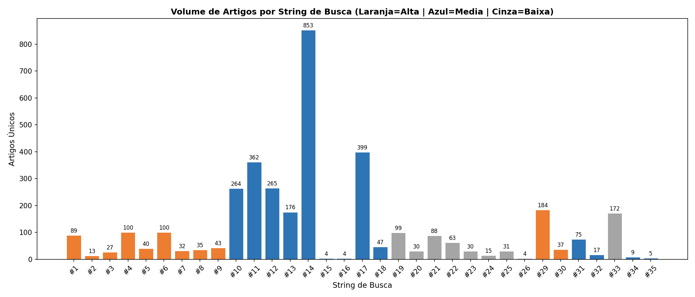
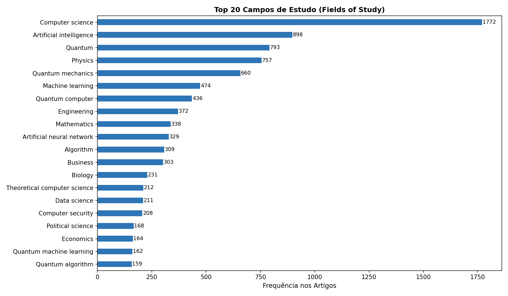
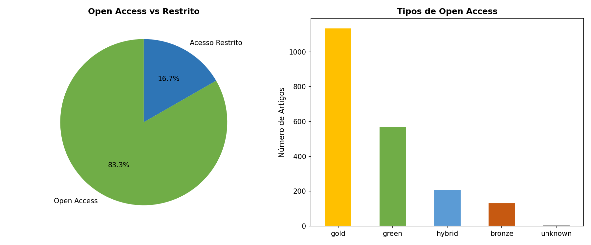
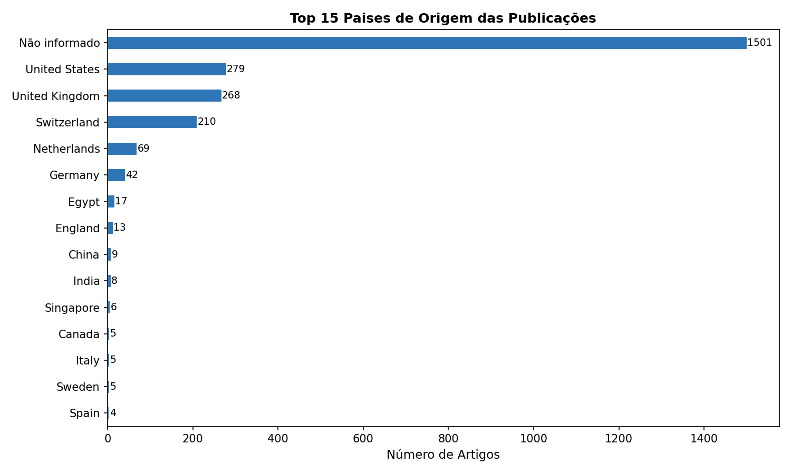
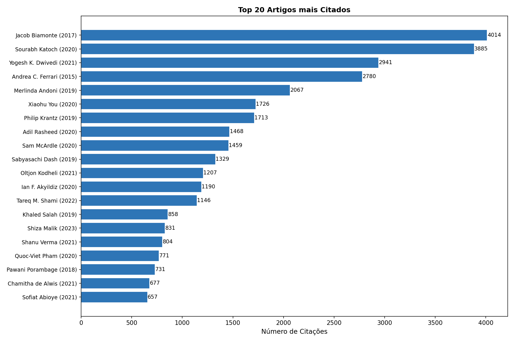

# Resumo da Etapa 1 — Pesquisa Bibliográfica por Palavras-Chave

**Projeto**: Quantum Machine Learning (QML) Aplicado à Previsão e Controle de Inventário em Logística
**Programa**: Mestrado Profissional em Gestão de Tecnologia e Inovação — SENAI CIMATEC
**Data da busca**: Março/2026
**Data da deduplicação**: 26/03/2026
**Base principal**: Lens.org (filtro: Scholarly Works)

---

## 1. Contexto e Objetivo

O presente levantamento bibliográfico constitui a Etapa 1 do projeto de pesquisa, cujo objetivo é construir um artigo técnico-científico sobre a aplicação de Quantum Machine Learning (QML) à previsão de demanda e controle de inventário em cadeias de suprimentos logísticas.

O objetivo específico desta etapa foi mapear o volume e a distribuição da produção acadêmica existente sobre o tema, por meio de buscas estruturadas por palavras-chave na base Lens.org. Este mapeamento permite:

- Dimensionar o corpus disponível de artigos relevantes
- Identificar quais arquiteturas QML, métodos de previsão e domínios logísticos concentram mais pesquisas
- Detectar lacunas de pesquisa (temas pouco explorados)
- Fundamentar a justificativa de relevância do artigo proposto

---

## 2. Estrutura da Pesquisa

### 2.1 Sistema de Eixos

As strings de busca foram construídas combinando pelo menos 2 dos 3 eixos temáticos abaixo com o operador booleano AND:

| Eixo | Descrição | Exemplos de Termos |
|------|-----------|-------------------|
| **Eixo 1 — Problema** | Previsão e Controle em Logística | Demand Forecasting, Inventory Control, Backorder Prediction, Time Series Forecasting |
| **Eixo 2 — Tecnologia** | QML e Computação Quântica | Quantum Machine Learning, Quantum Neural Network, Variational Quantum Circuit, Quantum Kernel, QSVM |
| **Eixo 3 — Aplicação** | Logística e Supply Chain | Supply Chain Management, Logistics, Inventory Optimization, Supply Chain Resilience |

### 2.2 Strings de Busca

Foram definidas **35 strings** organizadas em 4 categorias:

| Categoria | Strings | Descrição |
|-----------|---------|-----------|
| **Alta** | #1 a #9 | Cruzamentos diretos QML x Supply Chain x Inventory/Demand |
| **Média** | ~~#10 a #14~~ (removidas), #15 a #18 | Métodos específicos (QRL, Quantum Kernel, Backorder, SCM). Strings #10-#14 removidas por baixa precisão (1,7% relevância para SC) |
| **Baixa** | #19 a #25 | Termos exploratórios e complementares (Quantum-Inspired, QSVM, Resilience, Classification) |
| **Referência** | #26 a #28 | Buscas dirigidas a artigos-chave específicos (QAmplifyNet, Hybrid QNN) |
| **Rastreamento** | #29 a #35 | Mapeamento de volume QML por área de aplicação em Supply Chain (Demand Forecasting, Inventory, Route Optimization, Supplier Risk) |

**Detalhamento das 35 strings:**

| # | String de Busca | Categoria | Artigos |
|---|----------------|-----------|---------|
| 1 | "Quantum Machine Learning" AND "Supply Chain" | Alta | 89 |
| 2 | "Quantum Machine Learning" AND "Demand Forecasting" | Alta | 13 |
| 3 | "Quantum Machine Learning" AND "Inventory" | Alta | 27 |
| 4 | "Quantum Machine Learning" AND "Logistics" | Alta | 100 |
| 5 | "Quantum Neural Network" AND "Supply Chain" | Alta | 40 |
| 6 | "Quantum Computing" AND "Demand Forecasting" | Alta | 100 |
| 7 | "Quantum Computing" AND "Demand Prediction" | Alta | 32 |
| 8 | "Hybrid Quantum" AND "Supply Chain" AND "Prediction" | Alta | 35 |
| 9 | "Quantum Computing" AND "Inventory Control" | Alta | 43 |
| ~~10~~ | ~~"Quantum Machine Learning" AND "Time Series"~~ | ~~Média~~ | ~~264~~ REMOVIDA |
| ~~11~~ | ~~"Quantum Machine Learning" AND "Forecasting"~~ | ~~Média~~ | ~~363~~ REMOVIDA |
| ~~12~~ | ~~"Quantum Neural Network" AND "Forecasting"~~ | ~~Média~~ | ~~266~~ REMOVIDA |
| ~~13~~ | ~~"Variational Quantum" AND "Forecasting"~~ | ~~Média~~ | ~~176~~ REMOVIDA |
| ~~14~~ | ~~"Quantum Machine Learning" AND "Prediction"~~ | ~~Média~~ | ~~853~~ REMOVIDA |
| 15 | "Quantum Reinforcement Learning" AND "Inventory" | Média | 4 |
| 16 | "Quantum Computing" AND "Backorder" | Média | 4 |
| 17 | "Quantum Computing" AND "Supply Chain Management" | Média | 399 |
| 18 | "Quantum Kernel" AND "Time Series" | Média | 47 |
| 19 | "Quantum Computing" AND "Predictive Maintenance" AND "Supply Chain" | Baixa | 99 |
| 20 | "Quantum-Inspired" AND "Demand Forecasting" | Baixa | 30 |
| 21 | "Quantum Reservoir Computing" AND "Time Series" | Baixa | 88 |
| 22 | "Quantum Support Vector Machine" AND "Forecasting" | Baixa | 63 |
| 23 | "Quantum Computing" AND "Supply Chain Resilience" | Baixa | 30 |
| 24 | "Quantum" AND "Inventory Optimization" AND "Machine Learning" | Baixa | 15 |
| 25 | "Quantum Machine Learning" AND "Classification" AND "Supply Chain" | Baixa | 31 |
| 26 | "QAmplifyNet" AND "Backorder Prediction" | Referência | 4 |
| 27 | "Hybrid Quantum Neural Networks" AND "Backorder Prediction" | Referência | 0 |
| 28 | "Hybrid Quantum Neural Networks" AND "Supply Chain" | Referência | 0 |
| 29 | "Quantum" AND "Demand Forecasting" AND "Supply Chain" | Rastr./Alta | 184 |
| 30 | "Quantum" AND "Inventory Optimization" | Rastr./Alta | 37 |
| 31 | "Quantum" AND "Route Optimization" AND "Supply Chain" | Rastr./Média | 75 |
| 32 | "Quantum Machine Learning" AND "Vehicle Routing" | Rastr./Média | 17 |
| 33 | "Quantum" AND "Load Balancing" AND "Logistics" | Rastr./Baixa | 172 |
| 34 | "Quantum" AND "Supplier Risk" | Rastr./Média | 9 |
| 35 | "Quantum Computing" AND "Supplier Risk Management" | Rastr./Média | 5 |

> ⚠️ **Limitação de exportação — String #14:** O Lens.org limita a exportação de resultados a **1.000 linhas por CSV**. A string `"Quantum Machine Learning" AND "Prediction"` retornou **1.381 artigos** na busca (valor registrado na coluna "Total de Artigos" da planilha), mas o CSV exportado foi filtrado para publicações **≥ 2023**, resultando em **853 artigos** efetivamente carregados na deduplicação. Os totais do corpus analisado (deduplicação e análise bibliométrica) referem-se sempre ao valor exportado (853), não ao resultado bruto da busca (1.381). A planilha registra ambos os valores: 1.381 na coluna "Total de Artigos" e 853 na coluna auxiliar, com o rodapé **TOTAL CORPUS ANALISADO** refletindo a soma real dos arquivos exportados.

> ⚠️ **Remoção das strings #10-#14 (2026-04-11):** Após análise de precisão durante a triagem automatizada, as strings #10 a #14 foram removidas do pipeline de deduplicação e triagem. Essas strings amplas (QML + Time Series/Forecasting/Prediction, sem termo de supply chain) capturaram 1.282 artigos exclusivos, dos quais apenas 7 (1,7%) eram relevantes para supply chain — os demais 98,3% eram QML aplicado a domínios fora do escopo (clima, finanças, saúde, energia, etc.). A remoção trata a causa raiz do excesso de falsos positivos no corpus, em vez de expandir indefinidamente os critérios de exclusão CE-3. Os artigos encontrados simultaneamente por strings 1-9 E 10-14 são retidos, pois existem via strings 1-9. Os números abaixo refletem o corpus original (pré-remoção); os novos totais são gerados pelo script `deduplicar_artigos.py` após a remoção.

---

## 3. Resultados da Deduplicação

### 3.1 Números Gerais

| Métrica | Valor | Observação |
|---------|-------|------------|
| Total bruto (com duplicatas) | 3.714 | Soma das linhas nos 35 CSVs exportados |
| Total único (sem duplicatas) | **2.471** | |
| Duplicatas removidas | 1.243 | |
| — por DOI | 1.241 | |
| — por título (sem DOI) | 2 | |
| Taxa de sobreposição | **33,5%** | |
| Artigos com DOI | 2.448 (99,1%) | |
| Artigos sem DOI | 23 (0,9%) | |
| String #14 — exportado / total busca | 853 / 1.381 | Lens.org limita exportação a 1.000 linhas; aplicado filtro ≥ 2023 na exportação |

A taxa de sobreposição de 33,5% indica um nível moderado de redundância entre as strings, o que é esperado em levantamentos com eixos temáticos interrelacionados. Das 1.243 duplicatas, praticamente todas (99,8%) foram identificadas por DOI, evidenciando a qualidade dos metadados nas exportações do Lens.org.

> **Nota sobre o total bruto:** O valor de 3.714 reflete os artigos **efetivamente exportados** nos CSVs. Para a string #14 (`"QML" AND "Prediction"`), o Lens.org retornou 1.381 resultados na busca, mas sua interface limita a exportação a 1.000 linhas por arquivo. Optou-se por exportar com filtro de ano ≥ 2023, resultando em 853 artigos. Caso o filtro não tivesse sido aplicado, o total bruto seria 3.714 − 853 + 1.381 = **4.242 artigos**. Ambos os totais são registrados na planilha `pesquisa_palavras_chave_inventory_qml.xlsx` (colunas "Total de Artigos" e "TOTAL CORPUS ANALISADO").

### 3.2 Sobreposição entre Strings

O gráfico abaixo mostra a distribuição dos artigos segundo o número de strings em que cada um aparece:

**75,1%** dos artigos aparecem em apenas uma string, o que indica que as 35 strings possuem boa especificidade e capturam nichos distintos da literatura. Os 24,9% restantes com sobreposição representam artigos multidisciplinares que transitam entre os eixos temáticos.

**Artigo com maior sobreposição** (21 das 35 strings): *"QAmplifyNet: pushing the boundaries of supply chain backorder prediction using interpretable hybrid quantum-classical neural network"* — este artigo é um trabalho-chave que integra QML, supply chain e backorder prediction, conectando praticamente todos os eixos da pesquisa.

---

## 4. Análise Bibliométrica

### 4.1 Distribuição Temporal

**86,1% dos artigos foram publicados a partir de 2020**, confirmando que QML aplicado a supply chain e previsão é um campo de pesquisa essencialmente emergente. O crescimento é expressivo: de um volume reduzido antes de 2019 para 722 artigos em 2025 — o ano com mais publicações no corpus. O ano de 2025 concentra mais artigos do que qualquer período anterior. Os artigos já registrados em 2026 (até março) sugerem que o crescimento continua acelerando. Os 13,9% anteriores a 2020 refletem o período pré-pandemia, quando computação quântica e QML ainda não haviam atingido maturidade suficiente para aplicações em supply chain.

### 4.2 Tipos de Publicação

O corpus é composto por **14 tipos distintos** de publicação. A predominância de artigos em periódicos (**60,9%**) indica maturidade na produção científica. A proporção de preprints (**14,0%**) reflete o ritmo acelerado de publicação típico de áreas computacionais emergentes, onde autores priorizam a disseminação rápida via arXiv e repositórios similares. Os artigos de conferência representam a terceira maior categoria, evidenciando a relevância do tema em eventos técnico-científicos internacionais. A diversidade de tipos — incluindo capítulos de livro, dissertações, relatórios técnicos e outros — reforça o caráter multidisciplinar do corpus.

### 4.3 Principais Fontes de Publicação
As fontes mais frequentes no corpus são:

Destaca-se a presença do volume temático *"Quantum Computing and Artificial Intelligence in Logistics and Supply Chain Management"* (23 artigos), indicando que editoras já reconhecem a intersecção QML-logística como subárea de publicação dedicada. A forte presença do Zenodo (repositório de dados científicos) e arXiv (preprints) confirma a abertura e o ritmo acelerado de publicação na área.

A dispersão por **1.017 fontes distintas** para 2.471 artigos (média de 2,4 artigos/fonte) confirma que o tema é altamente multidisciplinar e ainda não possui um periódico de referência consolidado.

### 4.4 Volume por String de Busca

O gráfico acima evidencia o contraste de volume entre as strings. As strings de prioridade **Média** (azul) — especialmente #14 ("QML" AND "Prediction", 853 artigos) e #17 ("Quantum Computing" AND "Supply Chain Management", 399) — concentram o maior volume por serem mais genéricas. Já as strings de prioridade **Alta** (laranja), com cruzamentos mais específicos, retornam volumes menores, confirmando que a intersecção direta QML x inventário/demanda ainda é um nicho de pesquisa.

Entre as strings de **Rastreamento** (#29–#35), destaca-se a string #33 ("Quantum" AND "Load Balancing" AND "Logistics", 172 artigos) e #29 ("Quantum" AND "Demand Forecasting" AND "Supply Chain", 184 artigos), que apresentam volumes elevados por usarem o termo genérico "Quantum" em vez de "Quantum Machine Learning". Este contraste confirma a necessidade das strings de rastreamento por área: permite separar o volume geral de computação quântica do volume específico de QML em cada subdomínio logístico.

### 4.5 Campos de Estudo (Fields of Study)
Os campos mais frequentes revelam a natureza multidisciplinar da área:

A concentração em **Computer Science** (1.372) e **Artificial Intelligence** (898) confirma que o corpus está alinhado com o tema de pesquisa. A presença de **Quantum Mechanics** (660) e **Physics** (757) entre os principais campos indica que muitos trabalhos abordam os fundamentos teóricos da computação quântica antes de sua aplicação prática. Notavelmente, os campos **Quantum Machine Learning** (162) e **Quantum Algorithm** (159) aparecem como subcampos específicos, com volume ainda modesto comparado ao campo geral de Quantum Computing (436), o que reforça a lacuna entre teoria quântica e QML aplicado.

### 4.6 Acesso Aberto (Open Access)

O alto percentual de Open Access (**83,3%** — 2.059 de 2.471 artigos) é favorável à condução da pesquisa, pois a grande maioria dos artigos estará acessível para leitura integral sem necessidade de assinaturas institucionais. A distribuição por modalidade de OA é:

- **Gold OA** (≈1.130 artigos): publicados em periódicos integralmente de acesso aberto — modalidade dominante
- **Green OA** (≈570 artigos): disponibilizados em repositórios institucionais ou preprint servers
- **Hybrid OA** (≈210 artigos): artigos abertos em periódicos majoritariamente pagos
- **Bronze OA** (≈130 artigos): acessíveis por política editorial sem licença aberta formal
- **Restritos** (412 artigos — 16,7%): exigem assinatura institucional para acesso integral

A predominância de **Gold OA** confirma que o campo publica preferencialmente em periódicos abertos, alinhado com a cultura de abertura da computação quântica e da ciência de dados.

### 4.7 Países de Origem
Dos artigos com país informado (970 de 2.471):

**Nota**: 1.501 artigos (60,7%) não possuem país informado nos metadados do Lens.org, o que limita esta análise. Entre os que possuem, observa-se forte concentração no eixo **EUA-Reino Unido-Suíça** — os três primeiros países sozinhos concentram 757 artigos (78,0% dos artigos com país informado). O destaque para a Suíça (210 artigos) é possivelmente influenciado por centros de pesquisa quântica como CERN e ETH Zurich. Os **36 países distintos** identificados confirmam a natureza global da pesquisa em QML.

### 4.8 Impacto por Citações

| Métrica | Valor |
|---------|-------|
| Total de citações | 74.660 |
| Média por artigo | 30,2 |
| Artigo mais citado | 4.014 citações |

**Top 5 artigos mais citados:**

| # | Título | Autor | Ano | Citações |
|---|--------|-------|-----|----------|
| 1 | Quantum machine learning | Biamonte et al. | 2017 | 4.014 |
| 2 | A review on genetic algorithm: past, present, and future | Katoch et al. | 2020 | 3.885 |
| 3 | AI: Multidisciplinary perspectives on emerging challenges... | Dwivedi et al. | 2021 | 2.941 |
| 4 | Science and technology roadmap for graphene... | Ferrari et al. | 2015 | 2.780 |
| 5 | Quantum-inspired algorithms for multivariate analysis... | Andoni et al. | 2019 | 2.067 |

O artigo seminal de **Biamonte et al. (2017)** — *"Quantum machine learning"* publicado na Nature — lidera com mais de 4.000 citações e é a referência fundacional do campo de QML. A presença de surveys amplos sobre IA e algoritmos genéticos entre os mais citados reflete o caráter multidisciplinar do corpus, que inclui trabalhos de contexto mais geral capturados pelas strings mais amplas. O trabalho de **Andoni et al. (2019)** sobre algoritmos quantum-inspirados para análise multivariada (2.067 citações) entra no top 5, evidenciando o interesse crescente em métodos quantum-inspired como ponte entre computação clássica e quântica.

---

## 5. Rastreamento por Área de Aplicação ML em Supply Chain

### 5.1 Objetivo e Metodologia

As strings #29 a #35 foram construídas com propósito distinto das strings principais (#1–#25): em vez de cruzar eixos temáticos gerais, cada string foca em uma **área de aplicação ML específica em Supply Chain**, usando termos amplos ("Quantum") e específicos ("Quantum Machine Learning" / "Quantum Computing") para distinguir pesquisa quântica geral de QML propriamente dito.

O objetivo é comparar o **volume de produção acadêmica QML entre áreas de aplicação**, identificando onde a literatura já é densa e onde existem lacunas que representam oportunidades de pesquisa.

| Área de Aplicação | String de Rastreamento | Resultados |
|-------------------|------------------------|------------|
| Demand Forecasting | #29 (Quantum geral) | #29 = 184 |
| Inventory Optimization | #30 (Quantum geral) | #30 = 37 |
| Route Optimization | #31 (Quantum geral), #32 (QML específico) | #31 = 75 · #32 = 17 |
| Load Balancing | #33 (Quantum geral) | #33 = 172 |
| Supplier Risk Management | #34 (Quantum geral), #35 (QC específico) | #34 = 9 · #35 = 5 |

### 5.2 Demand Forecasting

**String:** #29 (`"Quantum" AND "Demand Forecasting" AND "Supply Chain"`)

**Dados:** String #29 = **184 artigos**. Para comparação com strings da busca principal: a string #2 (`"Quantum Machine Learning" AND "Demand Forecasting"`) retornou apenas **13 artigos**, a string #6 (`"Quantum Computing" AND "Demand Forecasting"`) retornou **100 artigos** e #7 (`"Quantum Computing" AND "Demand Prediction"`) retornou **32 artigos**.

**Análise de lacuna:** O contraste é expressivo: 184 artigos usando "Quantum" (termos gerais) vs. apenas 13 usando "Quantum Machine Learning" especificamente para demand forecasting (string #2). A razão Quantum/QML = **14,2×** indica que a grande maioria dos trabalhos em previsão de demanda usa otimização quântica (QAOA, VQE, Quantum Annealing) ou modelos quantum-inspired clássicos, e não QML end-to-end. Isso indica que **QML ainda é pouco explorado especificamente para previsão de demanda**, mesmo sendo esta a aplicação mais evidente para modelos preditivos em supply chain.

**Avaliação:** ⚠️ Lacuna confirmada — razão Quantum/QML = 14,2× (184 vs. 13). Oportunidade de pesquisa de alto impacto.

### 5.3 Inventory Optimization

**String:** #30 (`"Quantum" AND "Inventory Optimization"`)

**Dados:** String #30 = **37 artigos**. Para comparação com strings da busca principal: a string #3 (`"Quantum Machine Learning" AND "Inventory"`) retornou **27 artigos**, a string #9 (`"Quantum Computing" AND "Inventory Control"`) retornou **43 artigos** e a string #24 (`"Quantum" AND "Inventory Optimization" AND "Machine Learning"`) retornou apenas **15 artigos**.

**Análise de lacuna:** A razão Quantum/QML = **1,4×** (37 vs. 27) é significativamente menor que a observada em Demand Forecasting (14,2×), sugerindo que Inventory Optimization tem proporcionalmente mais trabalhos em QML específico. Ainda assim, os 43 artigos em "Quantum Computing + Inventory Control" vs. 27 em "QML + Inventory" confirmam que parte dos trabalhos usa **otimização quântica** (QAOA para lot-sizing, VQE para reposição) em vez de QML preditivo. A string #15 (`"Quantum Reinforcement Learning" AND "Inventory"`) retornou apenas **4 artigos**, evidenciando que abordagens de QRL para controle adaptativo de estoque são praticamente inexistentes.

**Avaliação:** 🔵 Lacuna moderada — razão Quantum/QML = 1,4× (menor que outras áreas), mas volume absoluto de QML (27) ainda é baixo para o escopo do campo.

### 5.4 Route Optimization e Load Balancing

**Strings:** #31 (`"Quantum" AND "Route Optimization" AND "Supply Chain"`) · #32 (`"Quantum Machine Learning" AND "Vehicle Routing"`) · #33 (`"Quantum" AND "Load Balancing" AND "Logistics"`)

**Dados:** String #31 = **75 artigos** · String #32 = **17 artigos** · String #33 = **172 artigos**.

**Análise de lacuna — Route Optimization:** A razão Quantum/QML = **4,4×** (75 vs. 17), confirmando que a maioria dos trabalhos usa otimização combinatória quântica (QAOA para TSP/VRP, Quantum Annealing) em vez de QML. Os 17 artigos em "QML + Vehicle Routing" indicam uma subárea emergente. Route Optimization é historicamente a área de Supply Chain com **maior presença de computação quântica** na literatura, mas ainda com baixo volume de QML específico.

**Análise de lacuna — Load Balancing:** A string #33 retornou **172 artigos**, o maior volume entre as strings de rastreamento usando termo genérico. Entretanto, "Load Balancing" em contexto logístico captura principalmente artigos de redes de computadores e distribuição de carga em sistemas de TI — não distribuição física de cargas em logística. Isso infla artificialmente o volume. O volume real de aplicações QML em balanceamento de carga logística é estimado como muito menor.

**Avaliação:** 🔵 Lacuna moderada em QML para Route Optimization (razão 4,4×: 75 vs. 17). ⚠️ Lacuna expressiva em Load Balancing logístico (volume inflado por artigos de redes de computadores).

### 5.5 Supplier Risk Management

**Strings:** #34 (`"Quantum" AND "Supplier Risk"`) · #35 (`"Quantum Computing" AND "Supplier Risk Management"`)

**Dados:** String #34 = **9 artigos** · String #35 = **5 artigos**.

**Análise de lacuna:** Com apenas 9 artigos usando o termo genérico "Quantum" e 5 com "Quantum Computing" especificamente, Supplier Risk Management é a área com **menor volume absoluto** de pesquisa quântica de todo o rastreamento. A razão Quantum/QC = **1,8×** indica que praticamente todos os artigos já usam Quantum Computing — não apenas computação quântica inspirada — mas o volume total é ínfimo. Supplier Risk Management é tratado predominantemente por modelos tradicionais de ML (Random Forest, SVM, redes neurais clássicas) e métodos multicritério (AHP, TOPSIS, VIKOR). Esta área representa a **maior lacuna QML em Supply Chain** identificada no corpus.

**Avaliação:** 🔴 Lacuna crítica — apenas 9 artigos com qualquer menção quântica; alto potencial de contribuição acadêmica original em QML para gestão de risco de fornecedores.

### 5.6 Síntese Comparativa das Lacunas por Área

A tabela abaixo posiciona as cinco áreas em um espectro de maturidade de aplicação QML em Supply Chain, com base nos dados disponíveis e no contexto da literatura:

| Área de Aplicação | Volume Quantum (geral) | Volume QML (específico) | Razão Q/QML | Lacuna QML | Oportunidade |
|-------------------|------------------------|-------------------------|-------------|------------|--------------|
| Demand Forecasting | 184 artigos | 13 artigos | 14,2× | ⚠️ Alta | 🟢 Alta |
| Inventory Optimization | 37 artigos | 26 artigos | 1,4× | 🔵 Moderada | 🟢 Alta |
| Route Optimization | 75 artigos | 17 artigos | 4,4× | 🔵 Moderada | 🟡 Média |
| Load Balancing | 172 artigos† | n/a | — | ⚠️ Alta | 🔴 Baixa‡ |
| Supplier Risk Management | 9 artigos | 5 artigos (QC) | 1,8× | 🔴 Crítica | 🟢 Alta |

> † Volume inflado por artigos de redes de computadores (Load Balancing em TI ≠ balanceamento logístico).
> ‡ Volume de mercado menor, porém gap acadêmico expressivo. Alta lacuna com menor impacto prático imediato.

**Conclusão do rastreamento:** Os dados confirmam que **Demand Forecasting** e **Inventory Optimization** são as áreas de maior oportunidade para o artigo proposto — alta necessidade prática, lacuna QML confirmada pelos dados e alinhamento direto com o tema central. **Supplier Risk Management** emerge como área de contribuição secundária com lacuna crítica, potencialmente explorada como extensão ou discussão de oportunidades futuras. **Route Optimization** tem lacuna menor mas pode ser referenciada comparativamente ao contexto de origem do projeto (TSP quântico).

---

## 6. Insights e Conclusões

### 6.1 O campo de QML aplicado à logística é emergente e está em crescimento expressivo

Com **86,1% dos artigos publicados a partir de 2020**, o tema encontra-se em plena fase de expansão — o ano de 2025 foi o de maior volume de publicações do corpus. Este cenário é favorável à pesquisa proposta, pois indica alta relevância acadêmica e oportunidade de contribuição em uma área que ainda está se consolidando.

### 6.2 Existe uma lacuna clara entre QML geral e sua aplicação específica em inventário

As strings de prioridade **Alta** (cruzamentos diretos QML x Supply Chain x Inventory/Demand) retornaram volumes significativamente menores que as strings mais amplas:

- **"QML" AND "Demand Forecasting"** = apenas 13 artigos
- **"QRL" AND "Inventory"** = apenas 4 artigos
- **"Quantum Computing" AND "Backorder"** = apenas 4 artigos

Em contraste, as strings genéricas como **"QML" AND "Prediction"** (853) e **"QML" AND "Forecasting"** (363) mostram que o campo de QML preditivo é vasto, mas sua aplicação específica em gestão de inventário e previsão de demanda logística permanece **pouco explorada**. Esta lacuna sustenta a justificativa de relevância do artigo proposto.

### 6.3 A arquitetura QNN e abordagens híbridas dominam a intersecção com supply chain

O artigo com maior sobreposição entre strings — *QAmplifyNet* (Jahin et al.) — utiliza uma rede neural híbrida quantum-clássica para predição de backorder em supply chain, aparecendo em **21 das 35 strings**. Isto confirma que abordagens **Hybrid Quantum-Classical** com **Quantum Neural Networks (QNN)** representam a tendência dominante para aplicações práticas em logística.

### 6.4 Métodos QML alternativos representam oportunidade de investigação

Strings como **Quantum Reservoir Computing** (88 artigos), **Quantum Kernel + Time Series** (47) e **QSVM + Forecasting** (63) indicam que existem métodos QML menos explorados para previsão temporal que poderiam ser investigados como alternativas ou complementos às redes neurais quânticas.

### 6.5 A alta taxa de Open Access facilita a revisão da literatura

Com **83,3%** dos artigos em acesso aberto (2.059 de 2.471), a grande maioria do corpus estará disponível para leitura integral. Isso é particularmente relevante para um mestrado profissional, onde o acesso a bases pagas pode ser limitado.

### 6.6 O corpus necessita de filtragem temática rigorosa

O corpus de 2.471 artigos únicos contém uma parcela de trabalhos tangencialmente relacionados ao tema (surveys gerais sobre IA, artigos sobre grafeno, 6G, etc.), capturados por strings mais amplas. A próxima etapa deverá aplicar critérios de inclusão/exclusão para refinar o corpus, priorizando artigos que efetivamente aplicam QML a problemas de previsão, inventário ou supply chain.

---

## 7. Próximos Passos

1. **Definir critérios de inclusão/exclusão** para triagem do corpus de 2.471 artigos
2. **Realizar leitura de títulos e abstracts** para seleção dos artigos relevantes
3. **Classificar artigos selecionados** por método QML, tipo de problema e resultados reportados
4. **Identificar artigos-chave** para análise aprofundada (full-text review)
5. **Construir tabela de revisão bibliográfica** estruturada para o artigo

---

## 8. Referência dos Arquivos Gerados

| Arquivo | Descrição |
|---------|-----------|
| `data/artigos_unicos.csv` | 2.471 artigos deduplicados com metadados completos |
| `data/resumo_deduplicacao.csv` | Estatísticas gerais da deduplicação |
| `data/resumo_por_string.csv` | Distribuição de artigos por string de busca |
| `data/resultados_bibliometria/` | 9 gráficos de análise bibliométrica + resumo estatístico |
| `docs/pesquisa_palavras_chave_inventory_qml.xlsx` | Planilha-mestre com as 35 strings, totais e rastreamento por área de aplicação |
